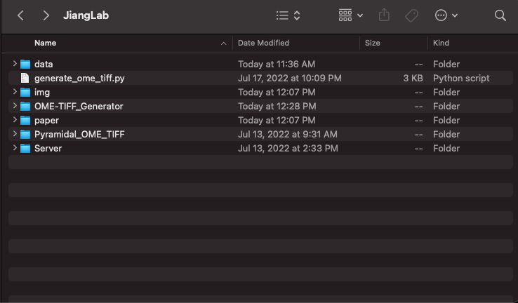
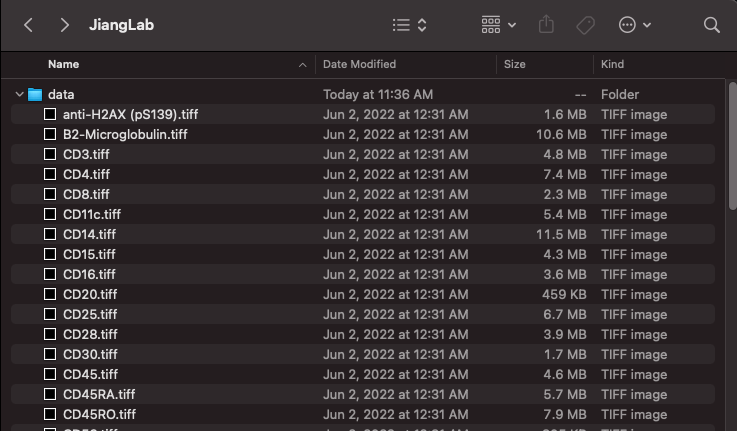
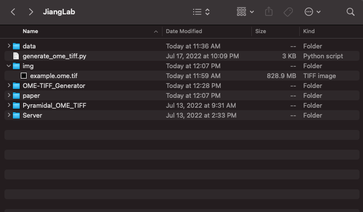

# OME-TIFF Generator
This script is created to combine multiple tiff images into a pyramidal OME-TIFF. The current version is working, but some improvements and more features will be added later.
## Basic Usage
Requires library [`tifffile`](https://github.com/cgohlke/tifffile). This script should be run as follows:

```
python generate_ome_tiff.py <PATH> <Pixel width> <Pixel height> -o<Output>
```

For each argument, 
- `<PATH>` should be the path to the directory with the tiff files you want to combine.
- `<Pixel width>` should be the pixel width resolution from your imaging instrument in **μm**.
- `<Pixel height>` should be the pixel height resolution from your imaging instrument in **μm**.
- `-o<Output name>` is an optional option that tells the program to name the output file after `<Output>`. If omitted, the output will be named after the directory and the OME-TIFF will be generated in the current working directory.

## Example

For this example, my working directory is `/Users/huayingqiu/JiangLab`.


Say I have the script and the tiffs in the following directories:

`/Users/huayingqiu/JiangLab/generate_ome_tiff.py`



and 

`/Users/huayingqiu/JiangLab/data`



The pixel size of is 0.38μm x 0.38μm. And I want to name the output file as `example.ome.tiff` and output into `Users/huayingqiu/JiangLab/img`. To do all these, I would run the following

`python generate_ome_tiff.py data 0.38 0.38 -oimg/example`

Then, voila, the pyramidal OME-TIFF is created. This OME-TIFF will be directly compatible with most readers, including the open-source Qupath.




Huaying Qiu


